# Basic Knowledge

## Ch1

### Accounting Data

**Internal user**:

- Management (Do we need to borrow in the near future?)
  Managers rely on accounting data to form
  their business decisions such as
  investment, financing and pricing
  decisions.
- Human Resources (Can we afford to give our employees a pay raise?)
  Employees are interested in knowing how well a company is performing as it could have implications for their job security and income.
- Finance (Is cash sufficient to pay dividends to the stockholders?)
  Preparing and monitoring budgets effectively requires
  reliable accounting data relating to the various activities,
  processes, products, services, segments and departments
  of the business.
- Marketing (What price for our product will maximize net income?)

**External user**:

- IRS
- Investors (Did the company earn a statis factory income?)
  Investors use accounting information to
  determine whether an investment is a good fit for
  their portfolio and whether they should hold,
  increase or decrease their investment.
- Labor Unions
- Creditors (Will the company be able to pay its short-term debts?)
  use accounting information of borrowers to
  assess their credit worthiness, i.e. their ability to
  pay back any loan.
  Lenders offer loans and other credit facilities on
  terms that are based on the assessment of
  financial health of borrowers.
- SEC
- Customers

### IFRS

International Financial Reporting Standards (IFRS)

International Accounting Standards Board (IASB) formulates IFRS

### GAAP

generally accepted accounting principles (GAAP)

Financial Accounting Standards Board (FASB) formulates GAAP

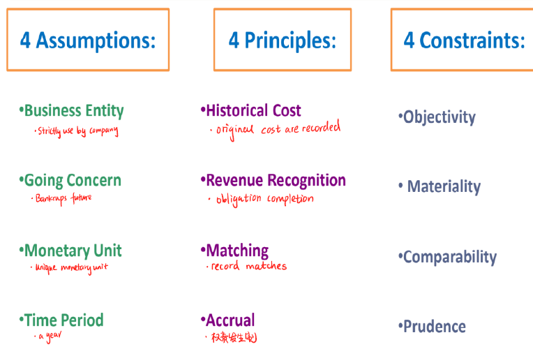

### Financial information

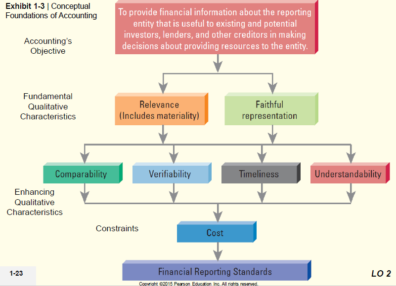

### Ethic

Ethics involves making difficult choices under pressure, and should be kept in mind in making every decision, including those involving accounting

## Ch2

### type of account

The type of account determines how to record increases and decreases.

**Debit account**

- increase when debit entry to account
- has debit balance

**credit account**

- increase when credit entry to account
- has credit balance (eg: Accounts Payable had a normal beginning balance of $1,700 means \$1,700 in credit) 

### Assets

**Natural of asset**: an economic resource that’s expected to benefit future operations

- Cash
- Accounts Receivable
- Notes Receivable
- Inventory
- Prepaid Expenses
- Land
- Building
- Equipment Furniture and Fixtures

### Liabilities

- Accounts Payable
- Notes Payable
- Accrued Liabilities (应付费用)

### Stockholders' Equity

- Common Stock
- Retained Earnings
  - Dividends
  - Revenues
  - Expenses

Sequence for recording transactions and preparing financial statements:

1. Journal
2. Ledger
3. Trail balance
4. Financial statements

## Ch3

### Accrual Accounting vs Cash-Basis Accounting

### Categories of Adjustments

1. Deferrals(延迟款项)

   - Prepaid expense

   - Unearned revenue

2. Accruals(应计项目)

   - Accrued expanse
   - Accrued revenue

3. Depreciation(折旧)

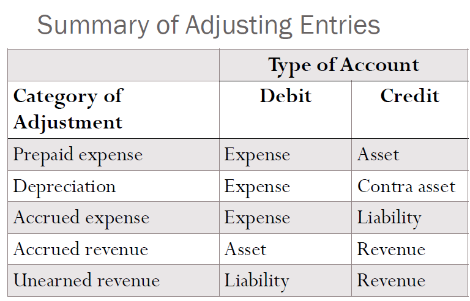

### Closing the book

- Done after financial statements are prepared
- Set temporary accounts to zero
- Transfers balances to retained earnings account
- Journalizes activity in Statement of Retained Earnings

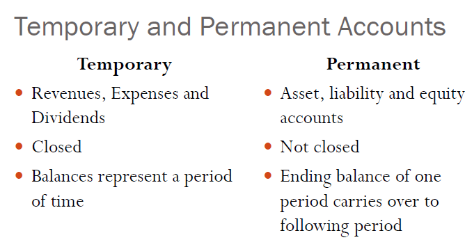

## Ch6 Inventory & Cost of goods sold

### Account for inventory

Inventory classified in the financial statements as an **asset**

As **cost of goods** on the **income statement**

Which accounts that Merchandisers have and service entities don’t?

cost of goods sold and inventory

#### Perpetual System

- Record revenue and asset received
- Record cost of goods sold and reduction of inventory

### Inventory cost methods

#### Specific unit

Used for businesses with unique inventory items

#### Average

weighted-average

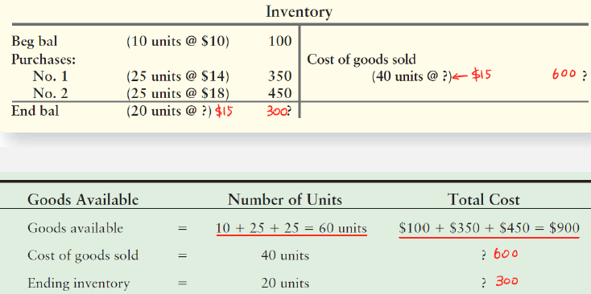

#### FIFO

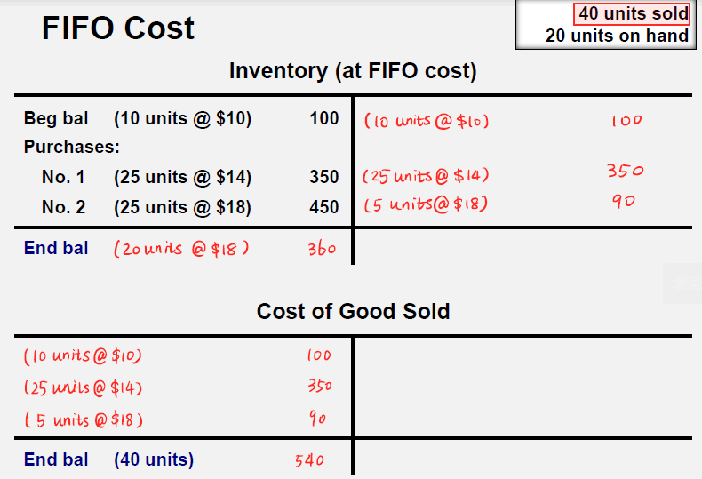

#### LIFO

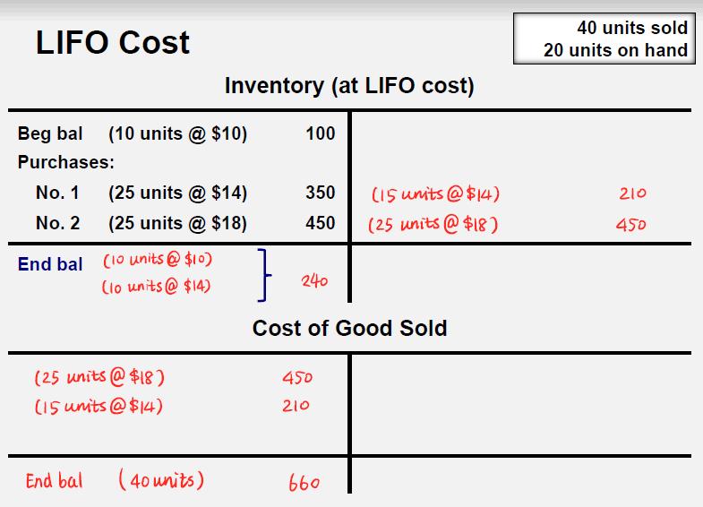

## Ch7 Plant Assets, Natural Resources and Intangibles

PPE: property, plant, and equipment

Depreciation is a process of allocating the cost of a  

Capital expenditures **increase the asset's capacity or extend its useful life**

Capitalized, means the cost is added to an asset account and not expensed immediately

### Depreciation Methods

#### Straight-line

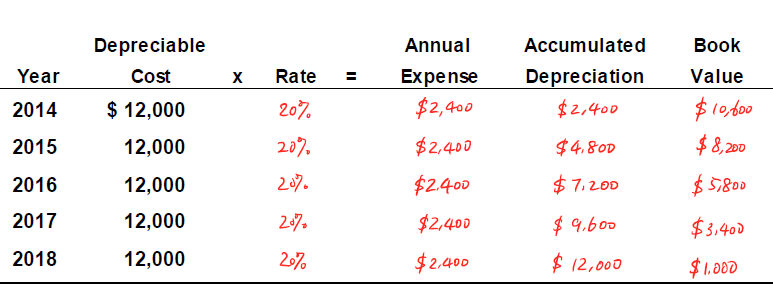

#### Units-of-Production

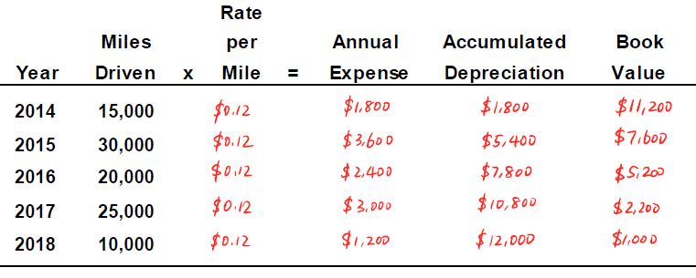

#### Double-declining-balance

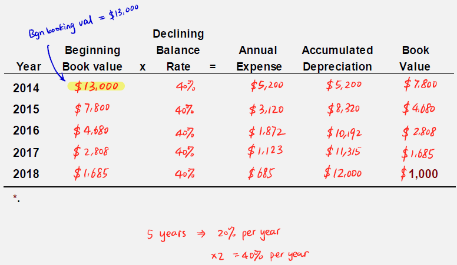

## Ch9 liabilities

A liability is a probable **future payment** of assets or services that a company is **presently obligated** to make as a result of a **past transaction or event**.

- Current Liabilities: Expected to be paid within one year
  - Estimated liability: Current liabilities of unknown Amounts
- Long-Term Liabilities: Expected not to be paid within a year.
- Contingent Liability: may only occur depending on the **outcome of an uncertain future event**. Example is a lawsuit

### Current Ratio

A ratio under 1 indicates that the company's debts due in a year or less are greater than its assets (cash or other short-term assets expected to be converted to cash within a year or less).

On the other hand, in theory, the higher the current ratio, the more capable a company is of paying its obligations because it has a larger proportion of short-term asset value relative to the value of its short-term liabilities

while a high ratio, say over 3, could indicate the company can cover its current liabilities three times, it may indicate that it's not using its current assets efficiently, is not securing financing very well, or is not managing its working capital.

#### Interest Payable

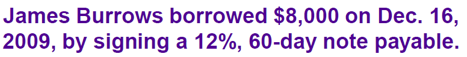

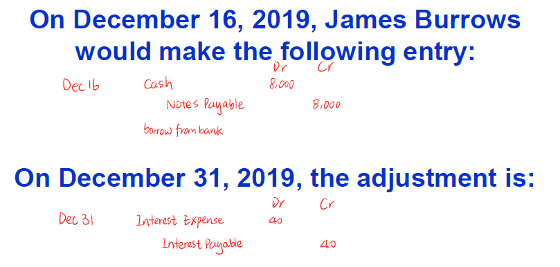

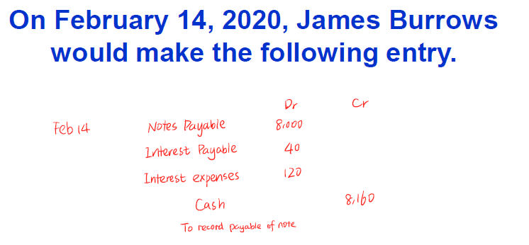

#### Sales Taxes Payable

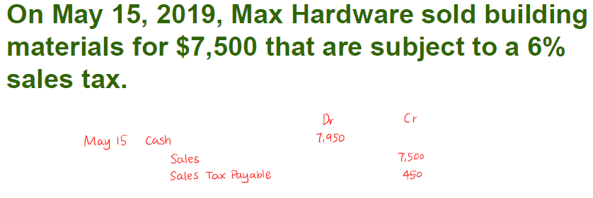

#### Unearned Revenues

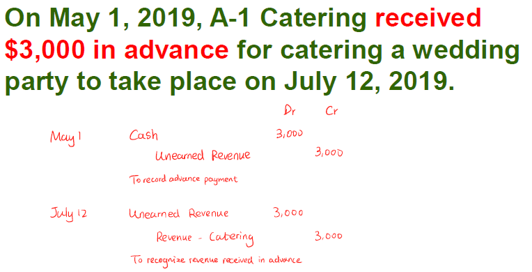

## Ch10 Shareholders' Equity

Shareholders' Equity represents the owners' claims against the assets of a corporation after deducting all liabilities.

Cash dividend become a legal liability on date of declaration and approval.

 

# Form

## T-Account

Record of increases and decreases in a specific asset, liability, equity, revenue, or expense element

- Debit - 'Left' (cash increase)
- Credit - 'Right' (cash decrease)

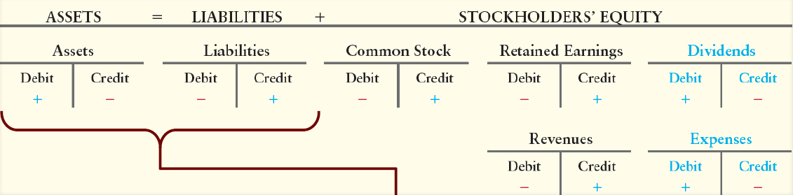

## Journal

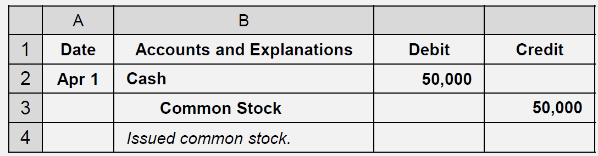

## Ledger

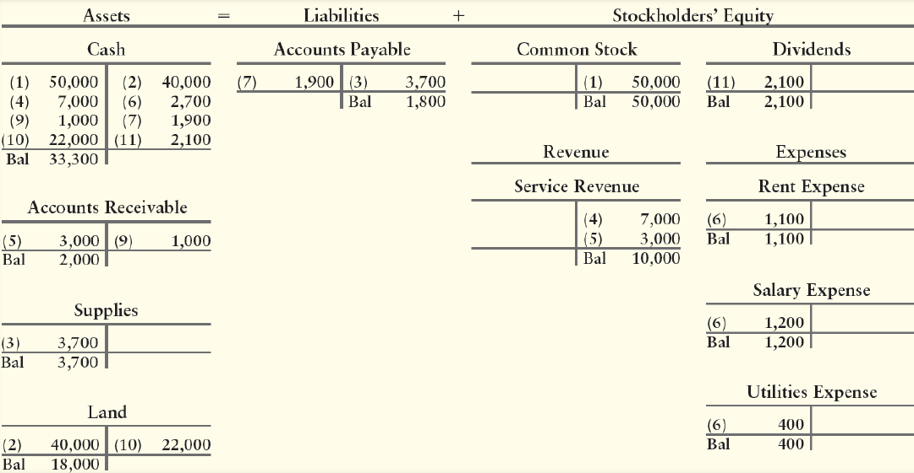

## Trial Balance

The list of all accounts with their balances

## Income statement

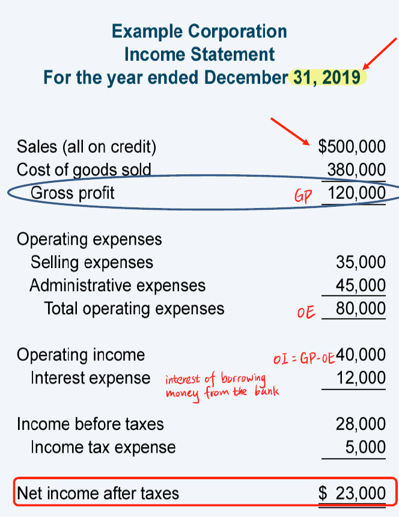

## Balance Sheet

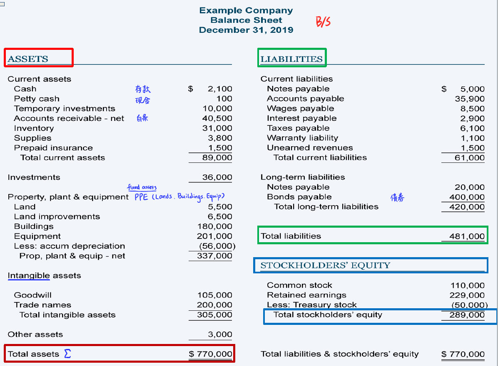

# Equation / Formula

*Equations are written in $\LaTeX$

## Basic

### Accounting equation

$$
Assets = Liabilities + Owner's Equity
$$

$$
Owner's Equity = Paid\text-in\ Capital + Retained\ Earnings
$$

Paid-in capital: amount stockholders have invested in the corporation

Retained earnings: amount earned and kept for use in the business

$$
Retained\ Earnings = Revenues - Expanses - Dividends
$$
Revenues: inflows to resources that increase retained earnings by delivering goods or services to customers

Expanses: resource outflows that decrease retained earning due to operations

Dividends: distributions to stockholders generated by net income

$$
Ending\ Balance\ of\ Retained\ Earnings = Begining\ Balance+ Net\ Income - Dividends
$$

### Carrying amount

$$
Carrying\ anoumt\ of\ the\ equipent = Equipment - Accumulated\ depreciation
$$

## Inventory

$$
Gross\ profit = revenue - cost\ of\ good\ sold
$$

$$
Goods\ available = Cost\ of\ goods\ sold + Ending\ Inventory
$$

$$
Ending\ Inventory = units\ of\ inventory\ on\ hand * cost\ per\ unit
$$

$$
Cost\ of\ goods\ sold = units\ of\ inventory\ sold * cost\ per\ unit
$$

$$
Cost\ of\ goods\ sold = Begining\ Inventory + Purchase\ in\ current\  period - Ending\ Inventory
$$

$$
Purchase\ in\ current\  period =  purchase - purchase\ returns\ and\ allowances + freight\text-in
$$

### Gross profit percentage

$$
Gross\ profit\ percentage = \frac{Gross\ profit}{Net\ sales\ revenue}
$$

### Inventory Turnover Ratio

$$
Inventory\ Turnover\ Ratio = \frac{Cost\ of\ goods\ sold}{Average\ inventory^*}
$$

$$
*Average\ inventory = \frac{beginning\ balance + ending\ balance}{2}
$$

## Depreciation

$$
Book\ value = cost\ of\ PPE - accumulated\ depreciation
$$

$$
Depreciable\ Cost  = Asset's\ cost- Estimated\ residual\ value
$$

$$
Depreciation\ expense\ per\ year = \frac{Cost - Residual\ value}{Useful life, in\ year}
$$

$$
Depreciation\ per\ unit\ of\ output = \frac{Cost - Residual\ value}{Useful life, in\ unit}
$$

$$
DDB\ depreciation\ rate\ per\ year = \frac{1}{Useful life, in\ year} * 2
$$

## Liabilities

### Current Ratio

$$
Current\ ratio = \frac{Current\ assets}{Current\ liabilities}
$$

### Interest Payment

$$
Interest\ Payment = Bond\ Par\ Value ×Stated\ Interest\ Rate * Time
$$

### Ratios

$$
Current\ ratio = \frac{Current\ assets}{Current\ liabilities}
$$

$$
Debt\ to\ asset\ ratio = \frac{Total\ debt}{Total\ assets}
$$

$$
Debt\ to\ equity\ ratio = \frac{Total\ debt}{Total\ equity}
$$

#### Profitability Ratios

$$
Gross\ margin\ ratio = \frac{Gross\ Margin}{Net\ Sales}
$$

# Quizzes & Questions

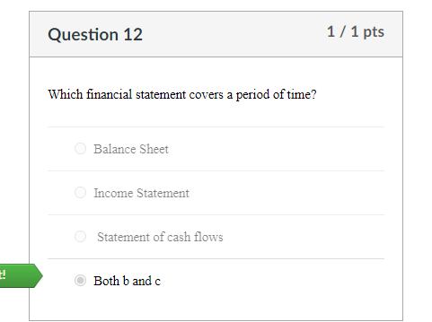

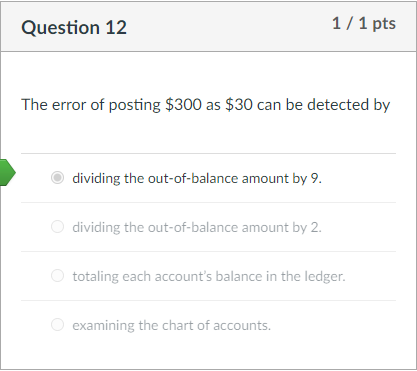

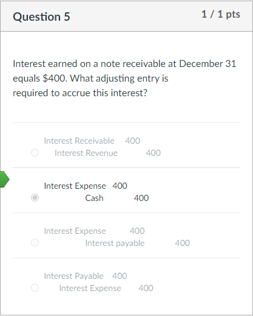

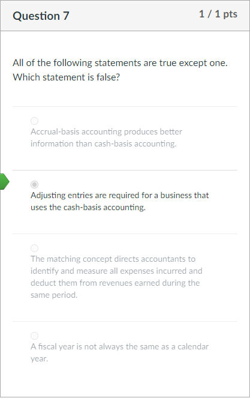

