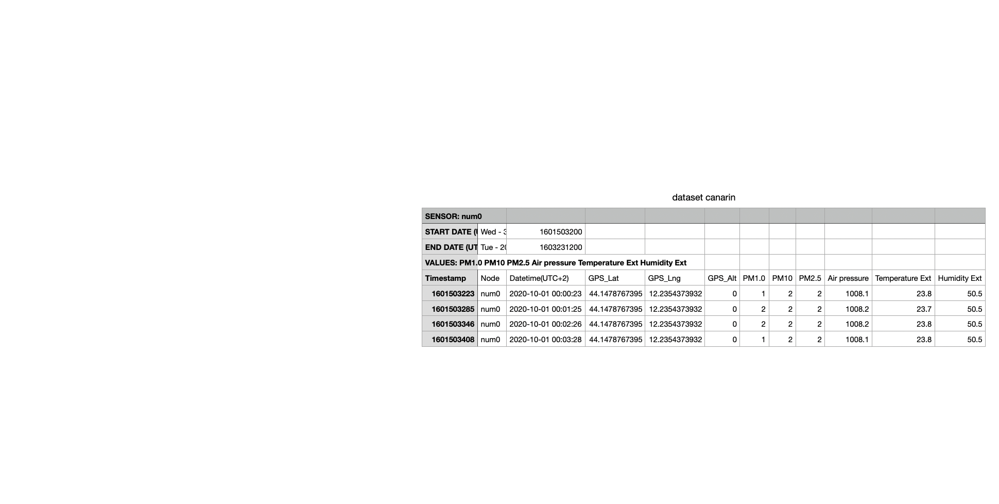

## Intro.
### Canarin Dashboard is a data visualization platform designed for Canarin II
Canarin II sensor is prevalent to collect data among researchers in IoT.  But the raw data collected by the sensor is not easy for users to read. To solve this problem, we show data in chart form and make users be able to interact with data.

---
# Technical Stack
## A Python driven Web App


Back-ended: 
* Django 2 
* SQLite 3

Front-ended: 
* BootStrap 
* Chart.js

---
## Design and Implementations
### Snippets of Codes

---
## Database Design @ [~/dashboard/db.sqlite3](~/dashboard/db.sqlite3)

```sql
❯ sqlite3 db.sqlite3                                                                                             
sqlite> .schema data_data
CREATE TABLE IF NOT EXISTS "data_data" (
    "id" integer NOT NULL PRIMARY KEY AUTOINCREMENT,
    "timestamp" integer NOT NULL,
    "gps_lat" real NOT NULL,
    "gps_lng" real NOT NULL,
	"gps_alt" integer NOT NULL,
    "pm10" integer NOT NULL,
    "pm2_5" integer NOT NULL,
    "airpressure" real NOT NULL,
    "temperature" real NOT NULL,
    "humidity" real NOT NULL,
    "node" varchar(40) NOT NULL,
    "datetime" datetime NOT NULL );
```


---

## Business Logic @ [~/dashboard/data/views.py](~/dashboard/data/views.py)

```python
# Home page view
class HomePageView(TemplateView):

# Map view class: supports select nodes by clicking the floor map
class MapView(TemplateView):

# Simplify datetime helper method
def simpleDatetime(datetime): return "%s-%s %s" % (m, d, time)

# Fetching server memory usage helper method: supporting macOS and Linux
def mem(): return math.floor((perc * 100) * 100) / 100
```

---

## Business Logic @ [~/dashboard/data/views.py](~/dashboard/data/views.py)

```python
# Render analysis page with date filter by context data from database

def analysis_filter_render(request, node, start, end):
    ...
	queryset = Data.objects.orderby('-timestamp').filter(datetime__range(start, end))
	return render(request, 'index.html', {
      'data': data,
      'mem_perc': mem_perc,
      'hasdata': hasdata
	})
```

---

## Business Logic @ [~/dashboard/data/views.py](~/dashboard/data/views.py)

```python
# Raw data table view class
class RawDataView(ListView):

# Data manuplation helper method: fillna
def correct_null(str, prv, index):
    if str == '':
        return prv[index]
    else:
        return str

# CSV data uploader
def data_upload(request):
    return render(request, template, {'section': 'data_upload', 'success': 'Upload Success!'})

```

---

## URLs Routering @ [~/dashboard/data/urls.py](~/dashboard/data/urls.py)
```python
urlpatterns = [
    path('node/<str:node>/', views.home, name='home'),
    path('node/<str:node>/<str:start>/<str:end>/', views.hometime, name='hometime'),
    path('', views.HomePageView.as_view(), name='homepage'),
    path('data_upload/', views.data_upload, name='data_upload'),
    path('map/', views.MapView.as_view(), name='map'),
    path('raw_data/', views.RawDataView.as_view(), name='raw_data')
]

```
---

### Visualization @ [~/dashboard/template/index.html](~/dashboard/template/index.html)

```html
<div class="col-xl-8">
	<div class="card card-default">
		<div class="card-header">
			<h2>Air Pressure <i style="color: red"> {{ hasdata }}</i> </h2>
		</div>
		<div class="card-body">
			<canvas id="AP" width="400" height="300"></canvas>
		</div>
	</div>
</div>
```

---

### Visualization @ [~/dashboard/template/index.html](~/dashboard/template/index.html)

```javascript
var ctx = document.getElementById('AP').getContext('2d');
var myChart = new Chart(ctx, {
    type: 'line',
    data: {
        labels: {{ labels | safe }},          // fetch label data from business logic layer
        datasets: [{
            label: 'Air Pressure',
            data: {{ AP | safe }},            // fetch air pressure data from business logic layer
            borderColor: '#fcb70a',
            backgroundColor: '#feba0d',
            borderWidth: 1
        }]
    }
});
```

---

### Clickable Map @ [~/dashboard/template/index.html](~/dashboard/template/index.html)

```html
Current Node: {{ node }} <br>

<!-- Node Selection with Map-->

	<a href="">  </a>


<!-- Display Node Information -->
<font size="2" color="#ff6347">* select nodes or click map to change node</font>
<div class="card-header">
	<h2>Node {{ node }}'s GPS Info</h2>
</div>
GPS - Longtitute: {{ GPS_lng }} <br>
GPS - Latitute: {{ GPS_lat }} <br>
GPS - Altitute: {{ GPS_alt }} <br>

```
---

### Data Upload @ [~/dashboard/template/data_upload.html](~/dashboard/template/data_upload.html)

```html
<div class="card card-default">
    <div class="card-header card-header-border-bottom">
        <h2>Upload Zone</h2>
    </div>
    <div class="card-body">
        <form action="" method="post" enctype="multipart/form-data"> 
            <label for="file1"> upload a file</label>
            <input type="file" id="file1" name="file" class="input-lg">
            <small>only accepts csv files</small>
            <button class="ladda-button btn btn-success btn-square btn-ladda" data-style="zoom-in" type="submit">
            <span class="ladda-label">Submit!</span>
            </button>
            <p style="color: tomato">{{ success }}</p>
        </form>
    </div>
</div>
```

