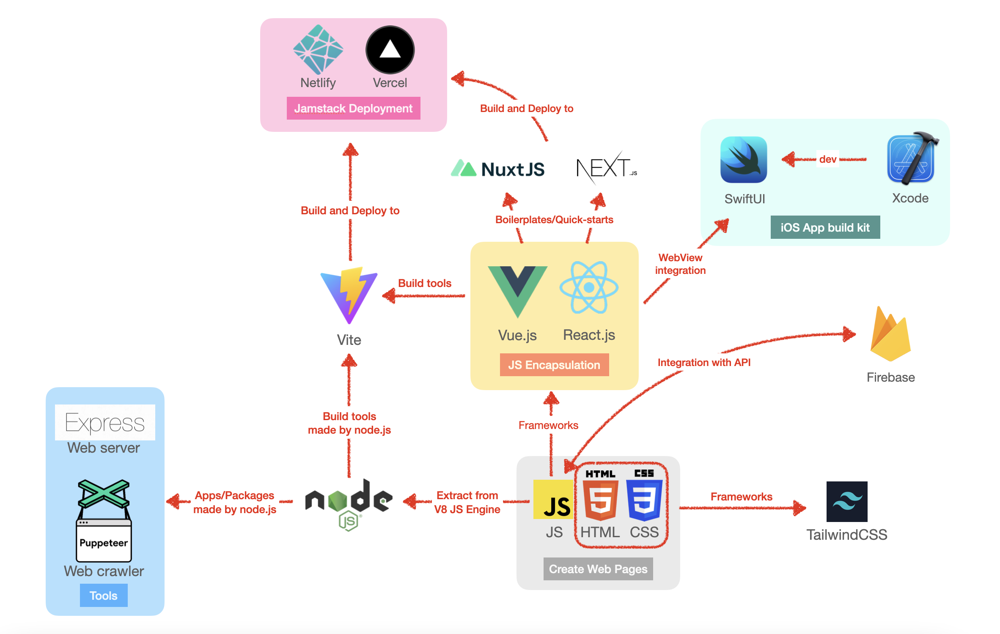
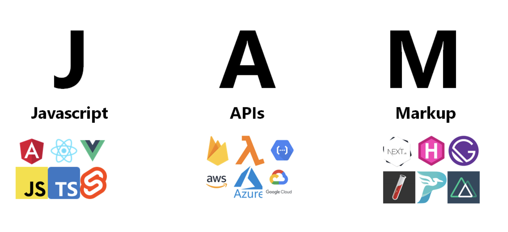
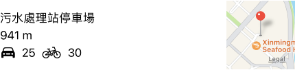

# Introduction

Due to the rapid development of the IT Industry, students in Universities are recommended to have internship experience to get their hands dirty with relatively latest and mainstream technologies since it is a good chance for them to accumulate their work experience and could benefit them in further occupational development. I am one of the students chosen to work at BluPurple for four weeks, hence; this report is based on my internship experience at BluPurple. I am glad to share my professional experience during the internship at a small-scale project development and designing company.

In this report, I will introduce the skills I gained, the employment role from the aspect of professional and academic preparations, and the pieces of knowledge acquired from MPU to aid my internship work. Besides, the availability and sources of self-learning in working will be illustrated. Moreover, from an occupational viewpoint, I will share my thoughts on developing IT projects, especially information systems design and software development.

## Overview

Blupurple Design Ltd. is a multimedia design company founded in Macau in 2012. Mainly focus on web design & development, mobile application (iOS & Android) design & development, and branding. BluPurple aim to develop products, the products we have launched, including Macau Movie App, MOcalendar. Website & App, Macau Weather App, Macau Nightclub Phonebook App, 10Guides Designer's platform, and much more in the future. [1]

The major work conducted by BluPurple is software development and UI designing. Within a four-week part-time internship at BluPurple, I briefly learned the workflow and recent technologies commonly used in the marketplace, such as TailwindCSS, Nuxt.js, Vercel, Google Firebase, and SwitUI. 

## Employment Role

The primary responsibility of the internship is to familiarize mainstream technical stacks in the marketplace, especially in Macao SAR. Unlike mainland China, enterprises are more likely to provide web applications to their users than integrated mini-programs in some social media platforms, such as the WeChat mini-program. That is because web applications have better generalizability and are easy to use by people with different preferences for software. Hence, a full-stack development experience could enhance the developer's adaptability for developing software for people in Macao. The training in BluPurple is an essential experience for a student whose occupational development meets the full-stack developing track.

The complete work includes developing a mock Macao Health Code form fill-in front-end interface with relevant business logic, a full-stack web application with google firebase as the backend, and a web scraping bot for content fetching and automatically sending designed for the previously mentioned firebase app, and, finally, a car parking lots data visualization native-look/native application which I plan to publish on the App Store. Having done a lot of exciting projects in BluPurple, I feel like this internship has been great. It is fulfilling that implement something while learning a technique.

## Objectives

The general objectives required to be achieved at the end of the internship are listed below.

* Mock Macao Health Code
* Google firebase app
* Bot for testing the google firebase app
* Native-like/native parking lots assistant app

# Reflection

## Work Performances

### Overview

The profession of software development needs a strong self-learning ability, which is one of the most vital abilities for students as well. Having done some searching on the Internet, I am confident to say that the availability of pieces of knowledge online, especially technologies in computer theory and programming areas, is at a high level. That means learning online could considerably benefit the occupation of a software developer and other IT-related jobs. The tech stacks I used during the internship could be learned from essay tutorials, videos, and official documents. Besides, with the power of the AI programming assistant, GitHub Copilot, learning a new tech stack could be much easier than before. Totally speaking, every single technology is not isolated from the others; they work together to achieve a further outcome. Technical speaking, they achieved this result by sharing APIs with each other or entirely further designing based on another technology as a relationship of encapsulation.

Specifically, during the internship, I learned several technologies: React.js, Next.js, Vue.js, Nuxt.js, Vercel, Netlify, TailwindCSS, Firebase, Puppeteer, SwiftUI, and Vite. The development environments: node.js, conda, and Swift; the IDEs I worked on are vim, WebStorm, and Xcode.

### Frameworks



We should figure out what these tech stacks could achieve and how they work together, hence; I have drawn a diagram that could aid in illustrating the relationship between these tech stacks. Modern web application development tools function like traditional JS, HTML, and CSS, however; since node.js, many frameworks have emerged. These frameworks are designed to achieve a higher level of web software design by encapsulating traditional tech stack, especially for JS. Such as, Vue.js is a progressive framework for building the user interface, which encapsulates DOM and exposes a virtual layer for developers to manipulate with actual DOM in the HTML file. As a result, Vue.js achieve efficient development compared with pure JavaScript. React.js functions similarly to Vue.js. However, developers can create a web application using only JavaScript codes, although JSX still has HTML-like codes to describe contents. Here is a comparison of Vue.js and React.js codes.

```vue
<script setup>
import { ref } from 'vue'
const name = ref('ex10si0n')
</script>

<template>
  <div>
    <div>Hello {{ name }}!</div>
    <input v-model="name" />
  </div>
</template>
```

```react
const { useState } = React;

const App = () => {
  const [value, setValue] = useState('ex10si0n');
  const handleChange = (e) => setValue(e.target.value);
  return (
    <div>
      <div>Hello {value}</div>
      <input value={value} onChange={handleChange} />
    </div>
  );
};
```

### JAMStack

The following image describes components and internal relationships in JAMStack technology, further illustrating the purple area in the previous diagram. A website claiming to use JAMStack should decouple the front-end and back-end with APIs, the front-end part has been built into HTML, CSS, and JavaScript files, and JavaScirpt can be introduced to pre-rendered sites on an as-needed basis. Hence, adopting JAMStack could lead to faster performance, a cheaper server expense that only stores static files, higher scalability, and better cooperation within developer teams. [2]



### Native Apps

Native App development is a trade-off between a better development experience and better UX (user experience). Due to the limitation of Web Browsers, some functionalities, such as invoking built-in system GPS, or notifications, could not easily be achieved by web applications. However, the web application has a responsive design, meaning a developer can design a web page once and distribute it to devices with different resolutions (i.e., changing the browser window size). The trade-off exists though, with mutual evolvement, whether Web Apps or Native Apps, the philosophy of client-side programming has been similar. Since web frameworks appeared, the front-end definition has been updated into a functional application rather than a user interface. Although a new-defined front-end is still in the payload of a web page, it works similarly to a native application. Since necessary functionalities have been reimplemented by JavaScript rather than implemented in the serverside back-end, modern front-end design only exchanges data with servers using API requests. Move back to native apps; although their evolvement is not as significant as a web application, with the number of updates supported by Google and Apple, native apps have many brand new application scenarios, such as AR and ML. Due to its advantages in 'descent', it is more robust and has higher compatibility among mobile phones, tablets, laptops, and desktop computers. Besides, the visual design standard is much more elegant in native app development, such as SwiftUI (Apple iOS), material design (Google Android), and fluent design (Microsoft Windows).


Similar to Vue.js Single Page Application, SwiftUI Apps can be built in an MVVM pattern. Besides, there are also terms in SwiftUI similar to Vue components called views. SwiftUI has the main entry that contains several embedded views; refer to the following code, which implemented each row of features recommendation.

```swift
var body: some View {
  HStack {
    VStack(alignment: .leading, spacing: 5) {
      Text(landmark.name)
      Text("\(Int(clCooridnate.distance(to: CLLocationCoordinate2D(latitude: lat, longitude: lng)))) m")
      HStack() {
        Image(systemName: "car.fill")
        Text("\(landmark.car)")
        Image(systemName: "bicycle")
        Text("\(landmark.motor)")
        Spacer()
      }
    }
    Spacer()
    MapView(coordinate: landmark.locationCoordinate, name: landmark.name)
      .frame(width: 100, height: 100, 
             alignment: .bottom)
      .ignoresSafeArea()
      .allowsHitTesting(false)
  	}.frame(height: 100)
  }
```

And the component renders an example:



Feel free to explore more exciting codes to implement mPark, and I have uploaded them on GitHub at Ex10si0n/MPark. Besides, internship codes have been open source at Ex10si0n/intern-codes for learning and referencing purposes. 

## Self-taught Skills

As mentioned before, it is vital to enhance self-learning skills at school or work. This has been made possible by a myriad of internet resources that offer programming education. Today, more than a thousand free programming books are available to download. Hundreds of free high-quality university courses on software engineering and computer science online MOOC platforms exist. There are dozens of programming tutorial companies that offer courses teaching hands-on programming knowledge - the internet provides “lifetimes-worth of programming knowledge and experience, available for free” [2]

Choosing learning resources that feature many code-along projects to start practicing. Most importantly, we need to make sure to code along and not just watch. This helps us to get started making something; we should try to build something with the new knowledge that we have gained.

I have benefited a lot from the content for learning for free. Hence I appreciate the open-source spirit a lot. So I created a blog to post some tutorials. Moreover, I have made public many of my project codes on GitHub [3].

##  Profession Development

We shouldn't just limit ourselves to theoretical details (vital as it is). We should utilize the knowledge and follow up the mainstream technology stack in the marketplace to build some helpful stuff. When I knew that many institutes still teach obsolete technologies and use textbooks from the last century, I was grateful to see the tech stack of the marketplace. During my internship, I felt a sense of accomplishment when I integrated what I had learned at the university and created something that would help me and others.

# Future Career Plan

## Academical Enhancement

Macao Polytechnic University is an application-oriented Institute that benefits me in my professional development; MPU has courses in Programming, Object-Oriented Technologies, and Internet Programming. I can say that these courses can aid a student's professional development as a programmer. Moreover, the Database Design, DBMS, and Data Warehousing modules can accumulate knowledge for a student who will carry out their occupation as a Database Administrator or doing data analysis. Besides, MPU provided me with an advanced academic view of one of the mainstream technologies - Artificial Intelligence and Machine Learning - which is more challenging and could provide me a chance to pursue fruitful achievements. Hence, not only through the internship, I realized that MPU had been gradually leading me to an occupation that is just the same as what I dreamed of.

## Self-evaluation

During the process of completing the internship, I am confident in my programming implementation ability since I am familiar with full-stack software development; however, I lack experience working in leading enterprises such as Tesla, Google, and Apple, where teams lead the development of IT. From many perspectives, they are the pioneers who use creativity and outstanding research ability to explore the industry’s future. I have dreamed of being a member of one of their teams and using my insight into computer science to explore these blue seas like autopilot, web3, quant, and the metaverse. As a graduate student with confident programming and research ability, I intend to pursue and seize cutting-edge opportunities to do pioneering work instead of following others’ game rules. I want to create my own story.

## Self-marketing

I would market myself by showing my ability in programming and research ability in computer science. Through the process of applying to graduate school, I worked a lot on reflection myself and have worked out a personal statement. I would like to share some pieces of self-introducing words.

Hello from Steve Yan; I am studying Computer Science at Macao Polytechnic University as an undergraduate. My projects are by far in the field of CLI Tools, Front-end and Back-end Web Applications, and iOS Mobile Apps. 

### Professional Experiences

I am passionate about computers and computing and have seven years of experience in programming. I have participated in the International Olympiad of Informatics ([www.noi.cn](www.noi.cn)) for three years, concentrating on algorithms implementation. I have also written technical blogs, developed and operated several projects, and contributed codes to open-source projects. I firmly believe interdisciplinarity is vital in computer science due to its application-oriented purposes. As a result, I have participated in several meetings of data science in finance at the Hong Kong Data Lab ([https://hkdatalab.com/](https://hkdatalab.com/)), and I am working on an open-source project for a quantitative cryptocurrency trader. 

I try not to limit my knowledge to theoretical details; I enjoy studying through implementing various projects. In addition, I am following up on the mainstream tech stack in the marketplace to build some practical applications. Because I have benefited a lot from online content learning, I appreciate the open-source spirit, and I have created a blog to post some tutorials and made my project codes on GitHub public: [https://github.com/Ex10si0n](https://github.com/Ex10si0n).

Besides, I implemented several projects during the internship at BluPurple: a front-end interface and logic for Health Code, an online chat room with Firebase as the backend, an automated chatbot with Puppeteer crawlers, and finally an iOS app, mPark, a local app that presents parking locations and parking slots that I plan to post on the App Store. I've done a lot of exciting projects in the space of eight days, and I think this internship has been great.

Moreover, I have worked as an Interest Group Lecturer at my University for three semesters in Algorithms and Machine Learning. I share my knowledge from my previous experience at the Olympiad in Informatics and my research project; moreover, many students have been motivated to implement codes after classes and discuss related topics with me. As a result, I have enhanced my skills when preparing for the courses and sharpened my communication skills in English.

In addition, I am a good user of English; I got an overall 7 points on IELTS and 319 on GRE. Besides, although my mother tongue is Mandarin, I have learned Cantonese since Year 1 in Macao. Hence, I am confident in my communication skills.

# Conclusion

In conclusion, I have finished the internship at BluPurple confidently. I gained professional insights and tried to "catch up" with the marketplaces via self-taught and meeting with industry insiders.

It is really a great experience to have an internship at BluPurple. I felt a sense of fulfillment when I integrated what I had learned at the university and created something that would help me and others. 

Besides, I really appreciate the encouragement and help from my colleagues and tutorials online. I will always treasure the help and encouragement I received during my internship at BluPurple.

# Reference

[1] https://www.linkedin.com/company/blupurple-design-ltd-

[2] https://jamstack.wtf

[3] https://www.grin.com/document/345715. 

[4] https://github.com/Ex10si0n

# Appendix

